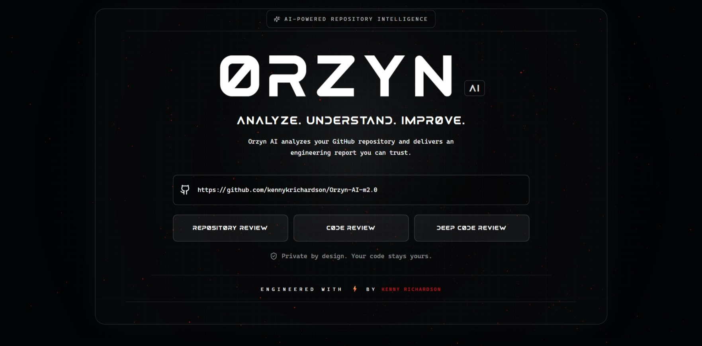
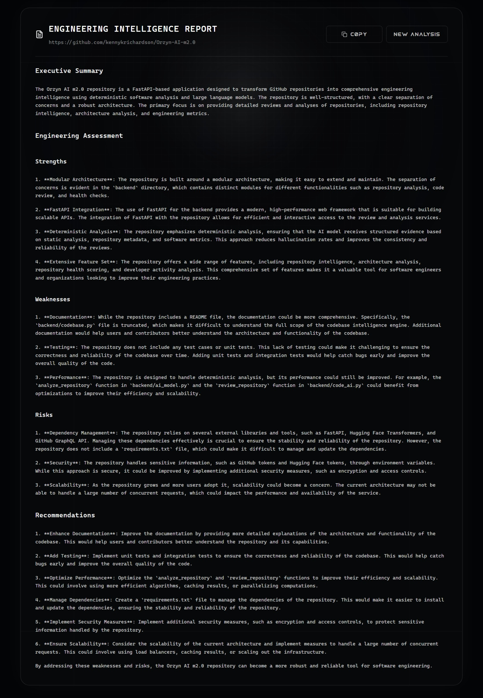

<div align="center">

# 🤖 ORZYN AI m2.0

### 🧠 AI-Powered Developer Intelligence Platform
   
Analyze. Understand. Improve.


---

### 🔍 Repository Intelligence • 💻 Code Reviews • 🔬 Deep Engineering Analysis

**Orzyn AI combines deterministic software analysis with Large Language Models to produce engineering reports grounded in real repository data instead of AI guesswork.**

</div>

---

# ✨ Features

### 🏛 Repository Intelligence

- 📦 Repository Metadata Analysis
- 📊 Repository Health Scoring
- 👨‍💻 Contributor Insights
- 📈 Development Activity
- 🔀 Pull Request Analytics
- 🐞 Issue Analysis
- 📚 Documentation Evaluation
- 🌐 GitHub GraphQL Integration

---

### 💻 AI Code Reviews

Choose the level of analysis you need.

| Review Mode | Description |
|--------------|-------------|
| 🏛 Repository Review | Engineering assessment using repository intelligence |
| 💻 Code Review | Medium-depth architectural code review |
| 🔬 Deep Code Review | Comprehensive repository & source code analysis |

---

### 🎨 Modern Frontend

- ⚛ React + TypeScript
- ⚡ Vite
- 🎨 Tailwind CSS
- 🌌 Animated Landing Page
- ✨ Particle Background
- ⌨️ Typewriter Report Rendering
- 📋 One-click Report Copying
- 📱 Responsive Design

---

### ⚙️ Backend

- 🐍 Python
- ⚡ FastAPI
- 🤗 Hugging Face Inference API
- 🔍 Static Repository Analysis
- 📊 Deterministic Metrics Engine
- 🧩 Modular Architecture
- 🚀 REST API

---

# 🧠 How Orzyn Works

Unlike traditional AI repository reviewers, Orzyn does **not** ask an LLM to inspect a repository blindly.

Instead, it follows a hybrid engineering pipeline.

```text
                    GitHub Repository
                            │
                            ▼
                 GitHub GraphQL API
                            │
                            ▼
          Deterministic Repository Analysis
                            │
          ┌─────────────────┴─────────────────┐
          ▼                                   ▼
 Repository Intelligence              Source Code Analysis
          │                                   │
          └─────────────────┬─────────────────┘
                            ▼
                 AI Reasoning & Interpretation
                            ▼
             Professional Engineering Report
```

The AI receives structured engineering evidence instead of raw repositories, producing reports that are more consistent, explainable, and significantly less prone to hallucination.

---

# 🚀 Getting Started

## Clone

```bash
git clone https://github.com/kennykrichardson/Orzyn-Ai-m2.0.git

cd Orzyn-Ai-m2.0
```

---

## Backend

Activate Virtual Environment

```bash
python -m venv .orzyn
.orzyn\Scripts\activate
```

Install dependencies.

```bash
pip install -r requirements.txt
```

Create a `.env` file.

```env
GITHUB_TOKEN=your_github_token
HF_TOKEN=your_huggingface_token
```

Start the API.

```bash
python -m backend.server
```
   (or)
   
```bash
uvicorn backend.api:apps --reload
```

Backend

```
http://localhost:8000
```

Swagger

```
http://localhost:8000/docs
```

---

## Frontend

```bash
cd frontend

pnpm install

pnpm dev
```

Frontend

```
http://localhost:5173
```

---

# 📡 API

## Repository Review

```http
POST /repository-review
```

Request

```json
{
    "repository": "https://github.com/owner/repository"
}
```

---

## Code Review

```http
POST /code-review
```

Medium Review

```json
{
    "repository": "...",
    "depth": "medium"
}
```

Deep Review

```json
{
    "repository": "...",
    "depth": "deep"
}
```

---

# 🏗 Project Architecture

```text
backend/
│
├── analysis/
├── github/
├── providers/
├── review/
├── api/
│
├── ai_model.py
├── code_ai.py
├── routes.py
├── schemas.py
└── server.py

frontend/
│
├── components/
├── pages/
├── services/
├── assets/
└── styles/
```

---

# 🎯 Engineering Philosophy

Orzyn follows one simple principle.

> **Deterministic systems compute facts. AI interprets facts.**

Repository statistics, metrics, health scores, and structural analysis are computed deterministically.

The AI is responsible only for engineering reasoning, architectural insights, and actionable recommendations.

This separation improves:

- ✅ Reliability
- ✅ Explainability
- ✅ Consistency
- ✅ Lower Token Usage
- ✅ Reduced Hallucinations
- ✅ Better Engineering Reports

---

# Screenshots

## 📡 Orzyn Landing Page



---

## 📈 Dynamic Analytics Graph



# 🛣️ Roadmap

## ✅ Completed

- ✅ Repository Intelligence
- ✅ AI Repository Reviews
- ✅ Code Review Engine
- ✅ Deep Code Reviews
- ✅ React Frontend
- ✅ FastAPI Backend
- ✅ Modern UI
- ✅ GitHub GraphQL Integration
- ✅ Hugging Face AI Integration

---

## 🚧 In Progress

- 🚧 Prompt Optimization
- 🚧 Multi-Provider AI Support
- 🚧 Local LLM Support
- 🚧 Improved Repository Context Selection
- 🚧 Faster Analysis Pipeline

---

## 🔮 Future

- 📊 Repository Comparison
- 👥 Team Analytics
- 📈 Historical Trends
- 🤖 Multiple AI Models
- ☁️ Cloud Deployment
- 🔌 Plugin System

---

# 🤝 Contributing

Contributions, ideas, bug reports, feature requests, and engineering discussions are welcome.

If you'd like to improve Orzyn AI, feel free to open an issue or submit a pull request.

---

# 📜 License

This project is licensed under the MIT License.

---

<div align="center">

## ⭐ If you found Orzyn AI interesting, consider giving it a star.

### Built with ⚡, ☕, Python and React.

**Analyze. Understand. Improve.**

</div>
